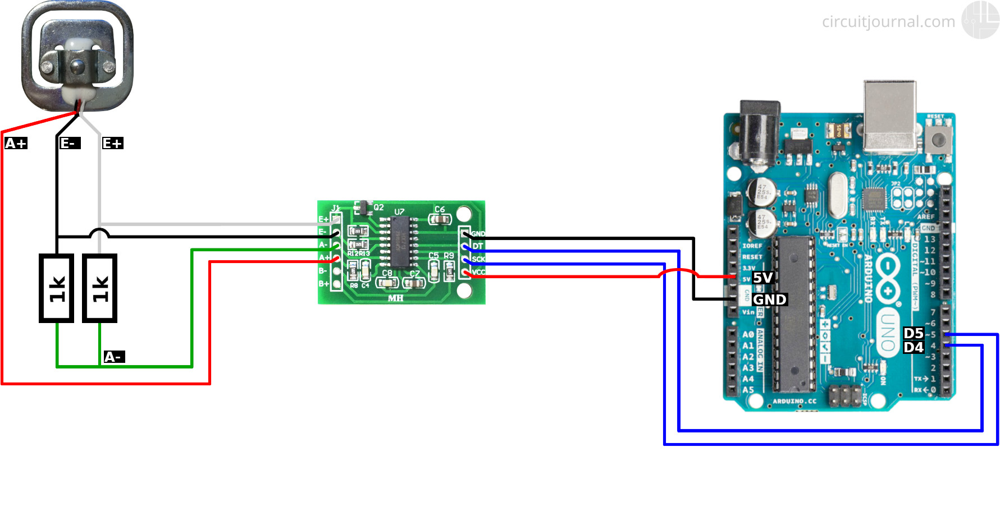
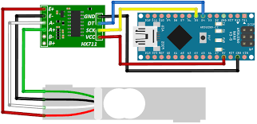

# HX711 Load Cell (5kg)    

> Descripción breve del HX711 Load Cell (5kg).

## Tabla de contenido

- [Características](#características)
- [Cómo funciona](#cómo-funciona)
- [Conexiones](#conexiones)
- [Bibliotecas y ejemplos](#bibliotecas-y-ejemplos)
- [Recursos adicionales](#recursos-adicionales)

## Características

Descripción detallada de las características del HX711 Load Cell (5kg).

## Cómo funciona

Explicación sobre cómo funciona el HX711 y su principio de operación.

*Figura 1: Diagrama de funcionamiento del HX711*

## Conexiones

Diagrama o esquema de las conexiones necesarias para utilizar el HX711 con tu microcontrolador o placa.

*Figura 2: Conexiones del HX711*

## Bibliotecas y ejemplos

- [HX711 Library for Arduino](https://github.com/bogde/HX711)
- [HX711 Library for Raspberry Pi (Python)](https://github.com/tatobari/hx711py)

Breve descripción de las bibliotecas disponibles y enlaces a ejemplos o tutoriales para utilizar el HX711.

## Recursos adicionales

- [Datasheet del HX711](https://cdn.sparkfun.com/datasheets/Sensors/ForceFlex/hx711_english.pdf)
- [Tutorial: How to Interface HX711 Balance Module with Arduino](https://lastminuteengineers.com/hx711-arduino-tutorial/)

Recursos adicionales, como datasheets, tutoriales o enlaces útiles relacionados con el HX711.

---

*¡Disfruta de tus proyectos con el HX711 Load Cell (5kg)!*

